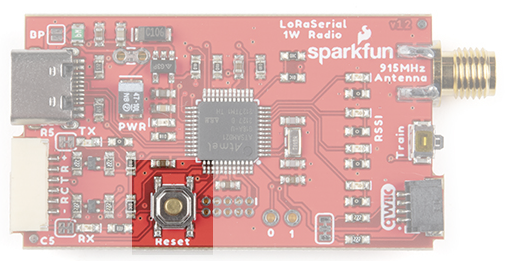

# Updating LoRaSerial Firmware

From time to time SparkFun will release new firmware for the LoRaSerial product line to add and improve functionality. Firmware can be upgraded using the SparkFun BOSSA GUI

## BOSSA GUI

The LoRaSerial utilizes a SAMD21 microcontroller. To update the firmware, obtain the SparkFun BOSSA GUI from [this repo](https://github.com/sparkfun/SparkFun_BOSSA_GUI). The GUI is a Qt5 based python script that can be run from the command line. Alternatively, Windows-compatible executables are available in the [release section](https://github.com/sparkfun/SparkFun_BOSSA_GUI/releases).

Next, get the latest LoRaSerial Firmware binary located in [LoRaSerial Binaries folder](https://github.com/sparkfun/SparkFun_LoRaSerial/tree/main/Binaries). Note: There are two types of firmware files, one 'with_bootloader' and one without. You can ignore the 'with_bootloader' type file.

*SAMD21 reset button*

Open the LoRaSerial enclosure to expose the reset button. Double-tap the reset button to enter bootloader mode. Now open the BOSSA GUI, select the Binary file you downloaded, select the COM port of the LoRaSerial device, and finally click 'Upload Binary'.