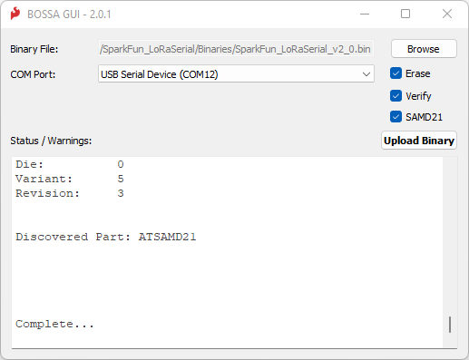
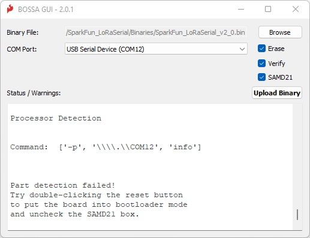

# Updating LoRaSerial Firmware

From time to time SparkFun will release new firmware for the LoRaSerial product line to add and improve functionality. Firmware can be upgraded using the SparkFun BOSSA GUI.

## BOSSA GUI

The LoRaSerial utilizes a SAMD21 microcontroller. To update the firmware, obtain the SparkFun BOSSA GUI from [this repo](https://github.com/sparkfun/SparkFun_BOSSA_GUI). The GUI is PyQt5 based on the Python SAM-BA Loader script that can be run from the command line. Alternatively, Windows, macOS and Linux-compatible executables are available in the [release section](https://github.com/sparkfun/SparkFun_BOSSA_GUI/releases). There is a Python package too, which works nicely on Raspberry Pi.

Next, get the latest LoRaSerial Firmware binary located in [LoRaSerial Binaries folder](https://github.com/sparkfun/SparkFun_LoRaSerial/tree/main/Binaries). Note: There are two types of firmware files, one 'with_bootloader' and one without. You can ignore the 'with_bootloader' type file.

Run the GUI.

Click `Browse` and select the firmware file.

Click the `COM Port` dialog box and select the correct port. On macOS, you will see two ports - select the one called `tty.usbmodem`.

Click `Upload Binary` to start the upload.

### Bootloader Mode

The BOSSA GUI will attempt to put the SAMD21 into bootloader mode automatically to perform the update. But we have noticed that this fails occasionally on some machines - it is machine-dependent.

On those machines, you will need to put the SAMD21 into bootloader mode manually by opening the case and giving the reset button a double-tap.

*Small Philips head screw*

Remove the two side screws and open the LoRaSerial enclosure to expose the reset button. 

*SAMD21 reset button*

Connect the LoRaSerial to the computer over USB. Double-tap the reset button to enter bootloader mode. You should see the blue LED slowly pulse on/off. Now open the BOSSA GUI, select the Binary file you downloaded, select the COM port of the LoRaSerial device. ***Uncheck the SAMD21 check-box*** and finally click `Upload Binary`.