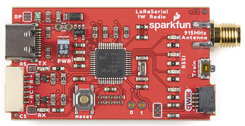
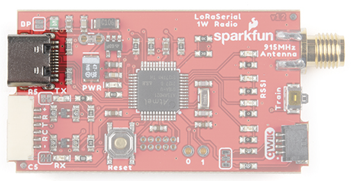
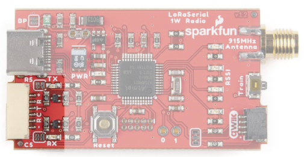
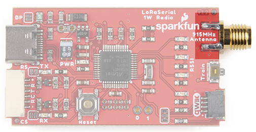
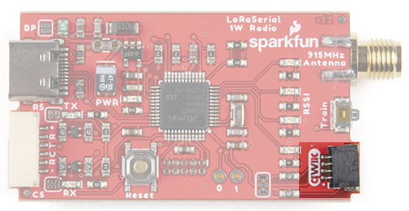
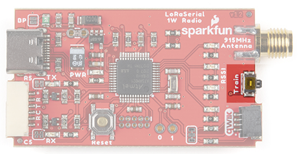
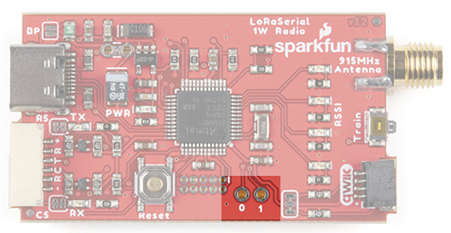
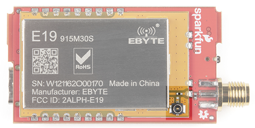

# Hardware Overview

The LoRaSerial is a SAMD21 based assembly with an SX1276 LoRa radio with innovative firmware to make things as simple as possible.

*SAMD21 based serial radio*

*1-watt module containing the SX1276 and a power amplifier*

The LoRaSerial uses a 1W LoRa radio based on the SX1276 radio along with a SAMD21 utilizing the UF2 bootloader. Any serial received at USB or serial port will be queued up, encrypted, and sent out over the radio. Any received packets are checked for CRC and Network ID, decrypted, then printed on both USB and serial interfaces.

Note: By default, there is a 50ms timeout in which the radio will wait for additional characters to be received until a partial frame is sent.

### USB C

*USB C connector for power and serial*

The USB C connector provides power and serial communication to the unit. LoRaSerial will automatically show up on a computer or SBC (single board computer) as a serial COM port at a default of 57600bps. Currently, only 8-N-1 serial communication is supported but we are open to additional features as users' needs arise.

### 6-Pin JST

*6-pin locking JST connector for power and  serial*

LoRaSerial features a ‘locking’ type 6-pin JST connector. The connector on LoRaSerial is X and mates with a connector JST-GHR-06V. Each LoRaSerial radio comes with a cable to connect from the JST connector to breadboard-friendly pins. If you need additional cables they are available [here](https://www.sparkfun.com/products/18079) (Note: the wire color may be different between cables). 

The pinout is as follows:

* **PWR** - 3.3-5V
* **RX** - Receive (Input into LoRaSerial)
* **TX** - Transmit (Output from LoRaSerial)
* **CTS** - Clear To Send (Input into LoRaSerial)
* **RTS** - Ready To Send (Output from LoRaSerial)
* **GND** - Ground

**PWR** (3.3-5V) - LoRaSerial requires 3.3 to 5V to operate. We recommend 5V for maximum transmission range but we’ve found operating off of a LiPo at 3.7 to 4.2V works great.

**RX** (Receive) - Connect this pin to the TX pin of your system. This pin is 3.3-5V tolerant and has an internal pull-up.

**TX** (Transmit) - Connect this pin to the RX pin of your system. This pin uses 3.3V logic.

**CTS** (Clear To Send) - (Optional) Connect this pin to a GPIO of your system. This pin is 3.3-5V tolerant and has an internal pull-up. When this pin is low LoRaSerial will continue to send data. If the host system pulls this pin high, the radio will stop sending data.

**RTS** (Ready To Send) - (Optional) Connect this pin to a GPIO of your system. This pin uses 3.3V logic. If the radio’s buffer (size currently is 4096 bytes) becomes full the system will drive RTS high indicating that it should not be passed more data. If more serial data is received, the buffer will be overwritten, oldest data first.

**GND** (Ground) - Connect this pin to the ground of your system.

#### Flow Control

If flow control is enabled, LoRaSerial will send data when its CTS pin is driven low (the host system is telling the radio to transmit). If flow control is enabled, LoRaSerial will drive its RTS low if its serial buffer is full (the radio is telling the host system to hold its horses). CTS and RTS pins are only exposed on the UART connector but if flow control is enabled, the UART flow control pins will apply to both USB and serial data streams. Internal pull-ups are used so if flow control is enabled, RTS and CTS must not be left floating. By default, flow control is turned off.

Hardware flow control applies to both the UART connection and the USB connector but in slightly different ways. 

The USB connection uses a concept called backpressure. It is not affected by the [FlowControl setting](http://docs.sparkfun.com/SparkFun_LoRaSerial/at_commands/#serial-commands) and cannot be disabled. If LoRaSerial is not able to read the incoming data fast enough, the USB driver will indicate to the host’s operating system that the data has not been consumed. Depending on the application, data will either be paused or lost. 

This is most obvious in applications such as STRSVR (from [RTKLIB](https://rtklib.com/)). If STRSVR sends more data to the LoRaSerial than it can consume, STRSVR will begin to buffer the data until it can be sent. This is problematic for time-sensitive data, such as RTCM, where data, being delivered successfully but delayed but multiple seconds, can cause problems with RTK. If RTCM data is multiple seconds old, an RTK Fix will go to RTK Float, then fail because current RTCM data is not being delivered to the far end of the radio link. The easiest way to fix the problem is to increase the AirSpeed of the link.

### RSSI LEDs

*4 LEDs indicating signal strength*

Four LEDs indicate in real-time the received signal strength or RSSI. These LEDs are meant to show a qualitative level of receive strength. Don’t worry if you’ve got three LEDs rather than four. LoRa technology is capable of transmitting a long range in harsh RF conditions. As long as you’ve got one LED, you will be able to send and receive data.

### RPSMA Connector

*Reverse polarized SMA antenna connector*

Attach a 915MHz RPSMA antenna to this port. Not sure which is SMA and which is RPSMA? Check out this [RF Connector Guide](https://www.sparkfun.com/pages/RF_Conn_Guide). The LoRaSerial is also compatible with any large 915MHz antennas including [fiberglass antennas](https://www.sparkfun.com/products/15597). We recommend a good thick RG58 RPSMA extension from the radio to your antenna to minimize loss. Remember, we are transmitting at 1W so keep your cables and connectors to a minimum.

Note: Be careful of antennas that have a gain higher than 6 dBi as this may violate the [maximum effective isotropic radiated power](https://afar.net/tutorials/fcc-rules/) (EIRP) for your area/country.

### Qwiic Connector

*Qwiic connector for I2C communication*

The Qwiic connector and I2C accessibility are not yet implemented.

### Train Button

*Button to enter train mode*

LoRa Serial uses a unique and very easy-to-use train feature. Each radio has a default Network ID and AES key programmed into it. Changing these keys is as easy as pressing a button! 

Using a ballpoint pen or other small pointed device, press and hold the Train button for 2 seconds, until you see the RSSI LEDs begin to blink. You can release the button. If the LEDs begin to cylon (bounce back and forth) the device has entered training ‘wait’ mode where it waits for another device to ping it.

On the second radio, press and hold the Train button for 2 seconds, until you see the RSSI LEDs begin to blink. Release the button. The RSSI LEDs on both units will blink in unison indicating that the units are now trained to each other.

For security reasons, the radios are both set to the lowest transmission power to minimize any eavesdropper from monitoring the transaction. While the ‘new’ keys are themselves encrypted, they are encrypted using a published AES key so one could theoretically back out the new AES keys if they are within ~30ft of the devices when the radios are being trained. If you’re paranoid, train the radios with the antennas off, within a few inches of each other. If total security is a concern, or if the radios cannot be physically brought near one another, the AES keys and/or the network IDs can be set via software commands.

### Internal Reset Button

*SAMD21 reset button*

The firmware on the LoRaSerial can be upgraded from a computer without ever having to open the unit. In the rare case that the SAMD21 needs to be forced into bootloader mode the reset button should be quickly double-tapped. The unit will then enter bootloader mode and wait for new firmware or for a reset event (button is pressed or power is cycled).

Please see [Updating LoRaSerial Firmware](http://docs.sparkfun.com/SparkFun_LoRaSerial/firmware_update/) for more information.

### GPIO

*GPIOs on SAMD21*

Two GPIOs capable of ADC are broken out for potential future use.

### U.FL Connector

*Zero ohm jumper resistor and U.FL connector*

For advanced users, the 915/868MHz modules feature a U.FL connector. This can be helpful if you need to embed the radio in an enclosure and need an external bulkhead RP-SMA connector. To use the U.FL connection, desolder the 0402 0Ω jumper and move it to the U.FL's RF path.

### Power Selection

LoRaSerial uses an onboard 'ideal' MOSFET to select the high voltage source between the USB connector and the VCC/GND of the UART connector. This allows dual power supplies to be applied without fear of back-feeding a higher voltage onto a lower voltage system.

## Enclosure

The enclosure is industrial 3D SLA printed with an effective IPX rating of IP52 (dust and waterdrop protected).

The enclosure is secured with two screws on either side of the unit. The top cover can be removed to expose the inner assembly.

*[LoRaSerial Dimensional Drawing](img/SparkFun_LoRaSerial_Enclosure_Dimensions.pdf)*

The enclosure includes mounting holes for wall or rack mounting.

**Note:** Leaving a LoRaSerial unit exposed to daylight outdoors or near a window will cause the cover to darken over a period of months. This will not affect the performance of the radio or the enclosure.

## Power Usage

The SX1276 based radio module is rated for 1 Watt. The radio can be adjusted from 14dBm up to 30dBm (default). 

**Note:** The **AT-TxPower** command ranges from 14 to 30 in dBm. The radio uses an internal lookup table to map the correct power output (30dBm by default) to the associated power level for the power amplifier (20 in this case).

During broadcast, the radio can use much more than 1W. Use a good 5V supply capable of outputting at least 1A at 5V. A USB 3.0 port is good. A USB 2.0 port will considerably limit the capabilities of the radio.

The power meter and hardware setup limited the ability to get to the full 30dBm output. The above measurements should be used as a rule-of-thumb for power considerations.

