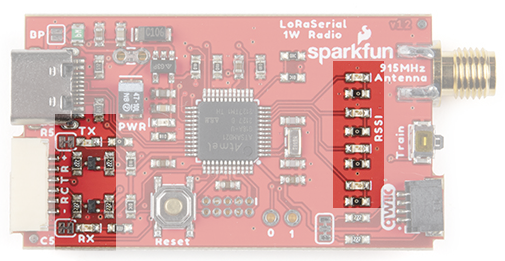

# LED States

A variety of LEDs are visible on the LoRaSerial radio to give the user feedback about the state of the system.

*LEDs on the LoRaSerial*

First lets define the LEDs on the LoRaSerial device.  The following diagram shows the various LEDs:

        Antenna         Qwiic
    +---------------------------+
    |                           |
    |     G4   G3   G2   G1     |
    |                           |
    |                           |
    |                       Red |
    |                           |
    |                           |
    |            Blue    Yellow |
    |                           |
    +---------------------------+
        USB            Serial

The red LED is the power indicator.  G1 through G4 in the diagram above are all green LEDs.

The LED behavior may be changed by using the AT-SelectLedUse command and setting the value to one of the mode numbers described in the sections below.  As an example, if the radio is in multipoint mode the following serial data sequence causes the LEDs to display more information about the radio behavior.

    +++
    AT-SelectLedUse=0
    ATO

## LED Mode 0 (LEDS_MULTIPOINT)

When the radio is in multipoint mode, selecting this mode for the LEDs provides additional insight into the radio's behavior.

* The G4 LED pulses when the radio transmits a frame.
* The G3 LED is pulse width modulated to indicate the last received RSSI level.
* The G2 LED turns on when the link is up (data can pass).
* The G1 LED pulses when the radio successfully receives a frame.
* The blue LED pulses on the server radio when the server transmits a HEARTBEAT frame.  The blue LED pulses on the client radio when the client successfully receives a HEARTBEAT frame from the server.
* The yellow LED pulses each time a channel hop (frequency change) occurs.

## LED Mode 1 (Default: LEDS_P2P)

When the radio is in point-to-point mode, selecting this mode for the LEDs provides additional insight into the radio's behavior.

* The G4 LED pulses when the radio transmits a frame.
* The G3 LED is pulse width modulated to indicate the last received RSSI level.
* The G2 LED is off.
* The G1 LED pulses when the radio successfully receives a frame.
* The blue LED pulses on the radio successfully receives a HEARTBEAT frame.
* The yellow LED pulses each time a channel hop (frequency change) occurs.

## LED Mode 2 (LEDS_VC)

When the radio is in virtual-circuit mode, selecting this mode for the LEDs provides additional insight into the radio's behavior.

* The G4 LED pulses when the radio transmits a frame.
* The G3 LED is pulse width modulated to indicate the last received RSSI level.
* The G2 LED pulses when serial data is received.
* The G1 LED pulses when the radio successfully receives a frame.
* The blue LED pulses on the server radio when the server transmits a HEARTBEAT frame.  The blue LED pulses on the client radio when the client successfully receives a HEARTBEAT frame from the server.
* The yellow LED pulses each time a channel hop (frequency change) occurs.

## LED Mode 3 (LEDS_RADIO_USE)

This mode is useful for users who want additional LED feedback about the RF link.

* The G4 LED pulses when the radio transmits a frame.
* The G3 LED is pulse width modulated to indicate the last received RSSI level.
* The G2 LED turns on when the link is up (data can pass).
* The G1 LED pulses when the radio successfully receives a frame.
* The blue LED will blink when the radio receives a bad frame.
* The yellow LED will blink when the radio receives a duplicate frame or receives frame where the software CRC does not match.

## LED Mode 4 (Default: LEDS_RSSI)

In the Received Signal Strength Indicator (RSSI) mode uses the green LEDs to indicate ranges of signal strengths:

* The RSSI LEDs indicate the signal strength of the last received packet:
    * -70 < RSSI: All green LEDs lit (strong)
    * -100 < RSSI <= -70: G3, G2, G1 LEDs lit, G4 off
    * -120 < RSSI <= -100: G2, G1 LEDs lit, G4 and G3 off
    * -150 < RSSI <= -120: G1 LED lit, all G4, G3 and G2 off (weak)
    * RSSI <= -150: <= All green LEDs off
* The blue TX LED indicates when serial data is received over the radio and sent to the host, either over USB or hardware serial.
* The yellow RX LED indicates when serial data is received from the host and sent over the radio.

## LED Mode 5 (LEDS_BUTTON_PRESS)

The button press mode is an internal mode used to indicate the state of the button press.  The green LEDs are counting seconds.  The following blue and yellow LED behavior occurs:

* Press time < 4 seconds: Blue LED is off and if in command mode or not performing training the yellow LED is off.  Otherewise if not in command mode and performing training the yellow LED is flashing and upon button release the radio exits training.

* 4 seconds <= button press time < 8 seconds: Yellow LED is off and if in command mode or not performing training the blue LED is off.  Otherewise if not in command mode and performing training the blue LED is flashing and upon button release the radio enters training in client mode.

* 8 seconds <= button press time < 16 seconds: If in command mode or not performing training both LEDs are off.  Otherewise if not in command mode and performing training the both LEDs are flashing and upon button release the radio enters training in server mode.

* 16 seconds <= button press time: Reset pattern caused by a system reset

## LED Mode 7 (LEDS_CYLON)

The cylon eye pattern in green is typically used to indicate radio training.  One green LED is lit at a time and the lit LED moves from side to side.

    G4    G3    G2    G1
                       X
                 X
           X
     X
           X
                 X
                       X
                 X
          ...

* The blue LED will blink when the radio transmits a frame.
* The yellow LED will blink when the radio successfully receives a frame.

## LED Mode 8 (LEDS_ALL_OFF)

This is a testing pattern with all LEDs off.

## LED Mode 9 (LEDS_BLUE_ON)

This is a testing pattern with only the blue LED on.

## LED Mode 10 (LEDS_YELLOW_ON)

This is a testing pattern with only the yellow LED on.

## LED Mode 11 (LEDS_GREEN_1_ON)

This is a testing pattern with only the G1 LED on.

## LED Mode 12 (LEDS_GREEN_2_ON)

This is a testing pattern with only the G2 LED on.

## LED Mode 13 (LEDS_GREEN_3_ON)

This is a testing pattern with only the G3 LED on.

## LED Mode 14 (LEDS_GREEN_4_ON)

This is a testing pattern with only the G4 LED on.

## LED Mode 15 (LEDS_ALL_OFF)

This is a testing pattern with all LEDs on.

## Other LED modes

Undefined LED modes display the RSSI pattern (mode 4).
